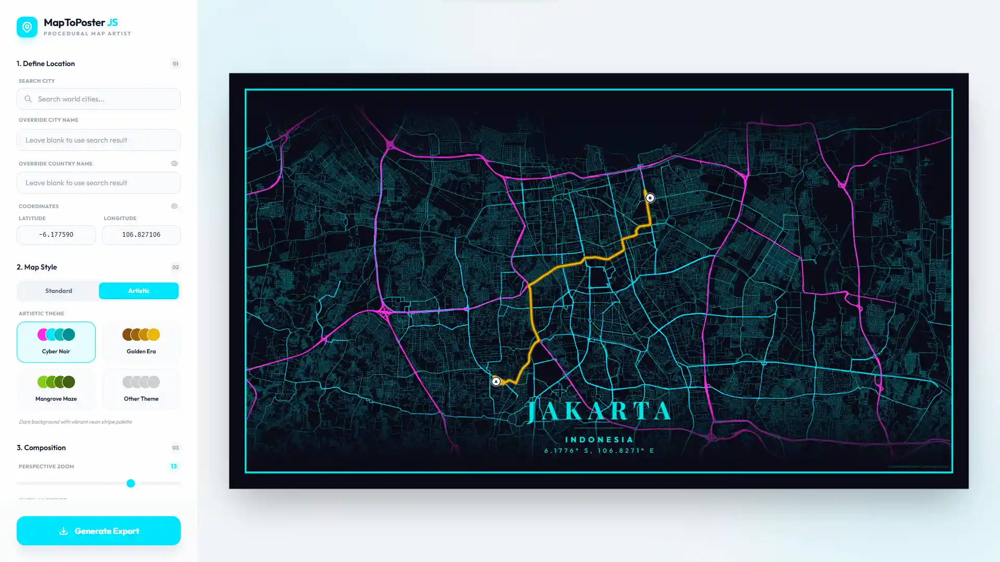

<p align="center">
  
</p>

# MapToPoster JS

[](https://developer.mozilla.org/en-US/docs/Web/HTML) [](https://developer.mozilla.org/en-US/docs/Web/CSS) [](https://developer.mozilla.org/en-US/docs/Web/JavaScript) [](https://tailwindcss.com/) [](https://leafletjs.com/) [](https://maplibre.org/) [](https://vitejs.dev/)


MapToPoster JS is a professional-grade, client-side web application designed to help you generate a custom Map To Poster with ease. Whether you're looking to create minimalist city art or a vibrant geographic keepsake, this tool allows you to search for any location in the world and transform it into a stunning Map To Poster piece with fully customizable themes, layouts, and high-fidelity export options. As a versatile Map To Poster generator, the application focuses on high-resolution output suitable for large-format printing, making it the perfect tool for creating unique wall art or personalized gifts.



## 🚀 Key Features

- **Hybrid Rendering System**: Seamlessly switch between efficient tile-based mapping (Leaflet) and procedural vector artistry (MapLibre GL).
- **Precision Geocoding**: Instant global location search powered by the Nominatim API.
- **Dynamic Markers**: Place, drag, and style multiple location indicators with various icons and adjustable sizes.
- **Custom Travel Paths**: Visualize journeys or specific itineraries with integrated route plotting and dynamic path fetching.
- **Mat / Passepartout Framing**: Apply a classic gallery-style framing effect with customizable width, border thickness, and opacity.
- **Elegant Typography**: A curated selection of premium fonts with full support for custom text and coordinate overrides.
- **Draggable UI Overlay**: A fluid city-label overlay with automatic edge-clamping and symmetric safety padding.
- **Background Edge Effects**: Improve readability using soft vignette shading or subtle transparency along the edges.
- **Layout Flexibility**: Independently toggle country names, geographic coordinates, and map labels for a tailored look.
- **Pro-Grade Exports**: Generate high-fidelity PNG files at custom resolutions or ultra-high resolutions (up to 50,000px).
- **Privacy & Performance**: Persistent settings via LocalStorage and 100% client-side rendering, your data never leaves your browser.

## 🎨 Themes

MapToPoster JS offers two distinct ways to style your maps:

### Standard Themes (Leaflet)
Based on high-quality raster tiles from established providers:
- **Minimal White**: Clean and modern (CartoDB Positron).
- **Midnight Dark**: Sleek dark mode (CartoDB Dark Matter).
- **Classic Street**: Standard OpenStreetMap cartography.
- **Modern Voyager**: Colorful and detailed (CartoDB Voyager).
- **Satellite View**: High-resolution imagery (Esri World Imagery).

### Artistic Themes (MapLibre GL)
Hand-crafted vector styles with procedural colors:
- **Arctic Frost**: Pale blues and crisp whites.
- **Aurora Glow**: Iridescent greens and pinks.
- **Cyber Glitch**: Neon accents for a digital look.
- **Paper Heritage**: Vintage sepia tones and inked roads.
- **Volcanic Ash**: Deep charcoal with glowing ember accents.
- **Blueprint Classic**: Technical cyanotype style for an architectural feel.
- ...and many more unique themes like Retro Synth, Charcoal Sketch, and Sakura Bloom.

### Customizing Themes
You can easily add your own artistic themes by editing [src/core/artistic-themes.js](src/core/artistic-themes.js):

1. Open `artistic-themes.js`.
2. Add a new object to the `artisticThemes` export:
```javascript
your_theme_key: {
    name: "Your Theme Name",
    description: "Brief description of the style",
    bg: "#HEXCODE",
    text: "#HEXCODE",
    water: "#HEXCODE",
    parks: "#HEXCODE",
    road_motorway: "#HEXCODE",
    road_primary: "#HEXCODE",
    road_secondary: "#HEXCODE",
    road_default: "#HEXCODE"
}
```
The application will automatically pick up the new theme and display it in the selection menu.

## 🛠️ Tech Stack

- **Framework**: Vanilla JavaScript (ES Modules)
- **Bundler**: [Vite 5](https://vitejs.dev/)
- **Mapping**: [Leaflet](https://leafletjs.com/) (Raster) & [MapLibre GL](https://maplibre.org/) (Vector)
- **Styling**: [Tailwind CSS 3](https://tailwindcss.com/)
- **Rendering**: [html2canvas](https://html2canvas.hertzen.com/)
- **Typography**: Google Fonts including Outfit, Playfair Display, and Cormorant Garamond
- **API**: Nominatim (Search) & OSRM (Routing)

## 📦 Getting Started

Follow these steps to get a local copy up and running.

### Prerequisites

* **Node.js**: Version 18.0.0 or higher
* **npm**: Usually comes with Node.js

### Installation & Setup

1. **Clone the repository**
   ```bash
   git clone https://github.com/dimartarmizi/map-to-poster.git
   cd map-to-poster
   ```

2. **Install dependencies**
   ```bash
   npm install
   ```

3. **Start development server**
   ```bash
   npm run dev
   ```
   The app will be available at `http://localhost:5173`.

4. **Build for production**
   ```bash
   npm run build
   ```
   Optimized files will be generated in the `dist/` folder.

## 📜 Technical Overview

1. **Reactive State Management**: Uses an observer-pattern based store ([src/core/state.js](src/core/state.js)) to synchronize changes across the UI, Leaflet, and MapLibre engines. All user preferences are persisted via `localStorage`.
2. **Hybrid Mapping Engine**: Implements bidirectional viewport synchronization between Leaflet (raster tiles) and MapLibre GL (vector themes), ensuring seamless layout consistency regardless of the active rendering mode.
3. **Draggable Overlay System**: Leverages real-time bounding box calculations to clamp label positions, ensuring a symmetric 8px minimum safety gap from the poster edges.
4. **Dynamic Asset Integration**: Manages custom GeoJSON routing and multi-marker instances with interactive drag-and-drop support across both map engines.
5. **Mat Framing Layer**: Implements a virtual "Mat/Passepartout" interface with customizable inset spacing and inner borders for a gallery-style finish.
6. **High-Fidelity Rendering Pipeline**: Captured exports utilize a multi-stage process in [src/core/export.js](src/core/export.js) to generate high-resolution map snapshots using `html2canvas` and the `onclone` callback.

## 🤝 Credits

- **Inspiration**: Inspired by [originalankur/maptoposter](https://github.com/originalankur/maptoposter). This project is an independent implementation built with a different stack and architecture.
- **Contributors**: A huge thank you to all the contributors who have helped improve this project through their code, bug reports, and suggestions. Your support makes this tool better for everyone.

## 📧 Contact

If you have any questions, suggestions, or just want to reach out, feel free to contact me at [dimartarmizi@gmail.com](mailto:dimartarmizi@gmail.com).

## ⚖️ License

This project is open-source and available under the [MIT License](LICENSE).
